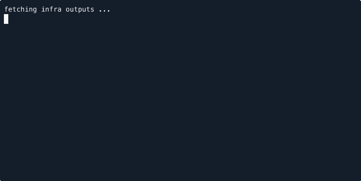

# asciimon


## autoscaling 

[](https://asciinema.org/a/Nx4IvyupmY1Wg9RZQJHtE7IsA)

```bash 
asciinema rec --command './utils/monitor.sh autoscaling' --capture-input --title 'Realtime Autoscaling monitoring with asciigraph' --overwrite autoscaling.cast
```

## ecs



[](https://asciinema.org/a/orByut2h4zEChgrtQcK9jADCk)

```bash
asciinema rec --command './utils/monitor.sh ecs' --title 'Realtime ECS Tasks monitoring with asciigraph'  --capture-input  --overwrite ecs-tasks.cast
```

## sqs

[](https://asciinema.org/a/qtxtLGHpKnRwahD4HXtfBYgER)

```bash
asciinema rec --command './utils/monitor.sh sqs' --capture-input --title 'Realtime SQS monitoring with asciigraph' --overwrite sqs.cast
```

